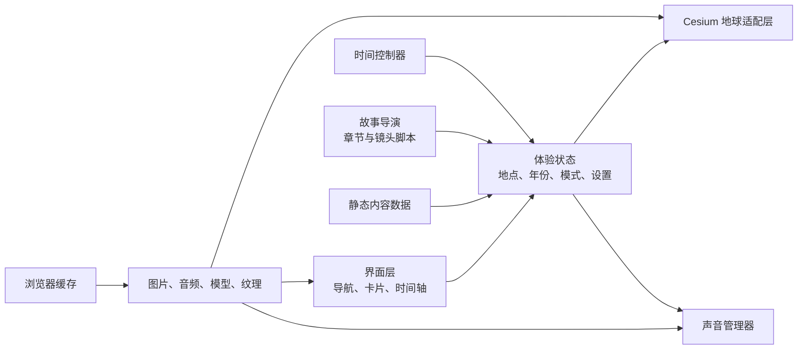
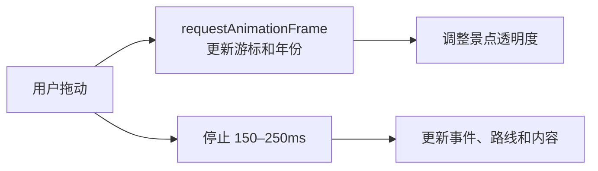

# Chrono Earth 技术与实施计划

版本：V1.0  
状态：可执行草案  
目标：完成可部署、可演示、可在桌面和移动端探索的纯前端 V1

## 1. 实施假设

- 一名主前端工程师负责实现。
- 视觉设计、历史内容和音频可以并行准备。
- V1 不建设自有后端。
- 地球、地形或影像允许使用第三方静态资源服务。
- 首批内容为人工策划，不进行自动抓取。
- 工期以 5–7 周为基准；若缺少内容和素材支持，应优先缩减故事数量而不是牺牲性能和完整性。

## 2. 推荐技术栈

| 层级 | 选择 | 说明 |
|---|---|---|
| 应用框架 | React + TypeScript | 管理界面、状态和组件 |
| 构建 | Vite | 纯前端构建与资源分包 |
| 3D 地球 | CesiumJS | 地球、相机、经纬度、影像与地形 |
| 动画 | GSAP | 首屏、镜头编排和故事时间线 |
| 状态管理 | Zustand | 管理当前地点、年份、模式和设置 |
| 样式 | CSS Modules 或原生 CSS | 便于精细动效与主题变量控制 |
| 数据校验 | Zod | 在构建期发现内容字段错误 |
| 图片 | AVIF/WebP | 降低媒体体积 |
| 3D 模型 | glTF/GLB + Draco | 按需加载少量重点地标 |
| 本地存储 | IndexedDB/localStorage | 收藏、声音和性能偏好 |
| 测试 | Vitest + Playwright | 数据、状态与关键交互验证 |

## 3. 总体架构



核心约束：界面不直接调用 Cesium API。所有地球操作通过 `GlobeAdapter` 统一处理，避免产品状态和渲染引擎耦合。

## 4. 建议目录结构

```text
chrono-earth/
├── public/
│   ├── data/
│   │   ├── places.json
│   │   ├── events.json
│   │   └── stories/
│   ├── images/
│   ├── audio/
│   ├── models/
│   └── textures/
├── src/
│   ├── app/
│   ├── components/
│   ├── features/
│   │   ├── globe/
│   │   ├── timeline/
│   │   ├── places/
│   │   ├── stories/
│   │   ├── audio/
│   │   └── onboarding/
│   ├── content/
│   ├── store/
│   ├── styles/
│   ├── types/
│   └── utils/
├── tests/
├── docs/
└── scripts/
```

## 5. 核心状态模型

```ts
type ExperienceMode =
  | "intro"
  | "explore"
  | "place"
  | "scrubbing"
  | "story";

interface ExperienceState {
  mode: ExperienceMode;
  currentYear: number;
  timelineScale: "civilization" | "era" | "event";
  selectedPlaceId: string | null;
  hoveredPlaceId: string | null;
  activeStoryId: string | null;
  activeChapterIndex: number;
  soundEnabled: boolean;
  reducedMotion: boolean;
  quality: "high" | "balanced" | "low";
}
```

状态切换必须显式定义，尤其要避免以下冲突：

- 用户拖动地球时故事镜头仍在控制相机。
- 用户拖动时间轴时景点卡片频繁重绘。
- 用户退出故事后年份和镜头没有恢复。
- 移动端底部抽屉手势与地球手势冲突。

## 6. 内容数据模型

### 6.1 地点

```ts
interface Place {
  id: string;
  name: string;
  localName?: string;
  country: string;
  coordinates: [longitude: number, latitude: number];
  altitude?: number;
  category: string;
  importance: 1 | 2 | 3;
  period: { start: number; end?: number };
  summary: string;
  coverImage: string;
  eventIds: string[];
  storyIds?: string[];
  camera: CameraPreset;
  sources: SourceReference[];
}
```

### 6.2 事件

```ts
interface HistoricalEvent {
  id: string;
  placeIds: string[];
  startYear: number;
  endYear?: number;
  title: string;
  summary: string;
  type: "construction" | "culture" | "trade" | "war" | "disaster" | "discovery";
  certainty: "documented" | "estimated" | "reconstructed";
  globalImportance: 1 | 2 | 3;
  sources: SourceReference[];
}
```

### 6.3 故事脚本

```ts
interface Story {
  id: string;
  title: string;
  durationSeconds: number;
  chapters: StoryChapter[];
}

interface StoryChapter {
  id: string;
  year: number;
  durationSeconds: number;
  camera: CameraPreset;
  visiblePlaceIds?: string[];
  visibleRouteIds?: string[];
  layers?: string[];
  caption: string;
  narrationAudio?: string;
  ambienceAudio?: string;
  imageOverlay?: string;
}
```

故事脚本只声明“发生什么”，地球适配层负责“如何渲染”，便于以后替换动画实现。

## 7. 地球渲染策略

### 7.1 图层顺序

1. 太空背景与星尘
2. 基础地球影像
3. 地形和海洋
4. 云层与大气
5. 历史区域或路线
6. 景点光点
7. 选中效果和关系线
8. HTML 信息界面

### 7.2 景点渲染

- 不为每个光点创建独立 DOM Marker。
- 使用单一 Primitive/PointPrimitiveCollection 或合批渲染。
- 点击检测通过 Cesium picking 完成。
- 根据相机高度和年份控制显隐。
- 标签只为悬停、选中和少量重点地点创建。

### 7.3 相机

- 预设全球、区域、城市、故事四类镜头。
- 飞行动画统一通过相机控制器执行。
- 任意用户主动拖动立即取消非故事模式的自动飞行。
- 故事模式中用户拖动时暂停故事，并明确显示“继续播放”。

## 8. 时间轴实现

时间轴分为两个刷新通道：

- 即时通道：年份数字、游标、景点粗粒度透明度。
- 延迟通道：路线、详细事件、卡片内容和媒体资源。

建议流程：



时间范围内部统一使用有符号整数：公元前为负数，公元为正数。显示层负责将 `-2500` 转换成“公元前 2500 年”。

## 9. 性能预算

### 9.1 首屏

- HTML、CSS、核心 JS 压缩后目标不超过 700KB。
- 首屏低精度纹理与必要字体合计目标不超过 3MB。
- 首屏总传输目标控制在 5–8MB。
- 3 秒左右进入可旋转状态；较慢网络先显示可交互低精度地球。

### 9.2 运行时

- 桌面目标 60 FPS，最低接受 45 FPS。
- 普通移动设备目标 30 FPS。
- 主线程长任务尽量小于 50ms。
- 同时播放的音频轨道不超过 3 条。
- 任意时刻只加载一个重点 GLB 模型。

### 9.3 自动降级

启动阶段进行轻量能力检测：

- `deviceMemory`
- `hardwareConcurrency`
- WebGL 能力与纹理限制
- 首 2 秒渲染帧耗时
- 用户的减少动态效果偏好

降级顺序：

1. 降低设备像素比。
2. 关闭阴影与高成本后处理。
3. 降低云层和星尘密度。
4. 停止持续动画。
5. 切换到低精度影像。
6. WebGL 不可用时进入 2D 列表与静态地球模式。

## 10. 资源与版权流程

每个外部素材都需记录：

- 来源 URL
- 作者或机构
- 授权方式
- 是否允许修改
- 是否要求署名
- 下载日期
- 对应页面或故事

上线前不得使用来源不明的网络图片、音乐或 3D 模型。历史事件文字也应保留主要来源，避免产品变成无出处的视觉拼贴。

## 11. 分阶段实施计划

### 阶段 0：方案与内容准备（2–4 天）

交付：

- 产品规格冻结
- 20 个景点清单
- 5 个故事提纲
- 素材与版权台账模板
- 低保真首屏和故事模式线框图

验收：

- 团队能回答“V1 做什么、不做什么”
- 每个景点具备经纬度、时间范围和至少 3 个事件
- 每个故事具备章节、年份和镜头意图

### 阶段 1：技术骨架与地球原型（3–5 天）

交付：

- React/TypeScript 项目骨架
- Cesium 初始化
- 风格化地球、大气和星空
- 鼠标与触摸旋转缩放
- 性能档位与 WebGL 降级入口

验收：

- 桌面和移动端均可旋转缩放
- 地球初始化失败时有可用替代界面
- 连续操作 3 分钟无明显内存增长

### 阶段 2：景点探索闭环（4–6 天）

交付：

- 景点数据校验与加载
- 光点批量渲染
- 悬停、点击、镜头飞行
- 景点预览卡片
- 搜索和随机探索

验收：

- 20 个景点位置正确
- 光点不会遮满地球
- 用户可以在 3 次操作内打开任一景点
- 移动端抽屉不与地球手势冲突

### 阶段 3：时间轴系统（4–6 天）

交付：

- 多尺度时间轴
- 年份拖动与关键年份磁吸
- 景点显隐联动
- 事件刻度与路线联动
- 自动播放历史

验收：

- 快速拖动保持流畅
- 停止拖动后详细信息正确更新
- 公元前后年份显示无歧义
- 时间轴键盘与触摸操作可用

### 阶段 4：故事导演系统（6–9 天）

交付：

- 故事脚本解析器
- 章节状态机
- 镜头、时间、图层、字幕与音频同步
- 暂停、继续、前后章节和退出
- 5 个故事中的至少 1 个完整样板

验收：

- 退出故事后状态恢复正确
- 用户操作相机时不会与自动镜头争夺控制
- 音频、字幕与章节基本同步
- 减少动态效果模式可完整看完故事

### 阶段 5：内容批量制作与视觉精修（7–12 天，可并行）

交付：

- 全部 20 个景点内容
- 全部 5 个故事
- 图片、音频、路线和必要模型
- 首屏与过渡动画精修
- 来源和授权信息

验收：

- 无占位文案和来源不明素材
- 所有故事内容经过事实检查
- 每个故事在桌面和移动端完整播放

### 阶段 6：性能、兼容与发布（4–6 天）

交付：

- 资源分包和按需加载
- 多档性能模式
- 键盘、字幕与减少动态效果支持
- 主流浏览器兼容修复
- 生产构建和部署

验收：

- 达到首屏与帧率预算，或记录明确偏差
- Chrome、Safari、Edge 最新稳定版通过
- iOS Safari 和 Android Chrome 完成核心流程
- 404、资源失败和 WebGL 失败均有可理解反馈

## 12. 里程碑

| 里程碑 | 结果 | 可演示内容 |
|---|---|---|
| M1 地球醒来 | 建立视觉基线 | 首屏、地球旋转、昼夜与大气 |
| M2 世界可探索 | 完成地点闭环 | 20 个光点、对焦与景点卡片 |
| M3 时间可操控 | 完成核心差异化 | 时间轴改变地点、事件和路线 |
| M4 历史可播放 | 完成叙事系统 | 1 个完整电影化故事 |
| M5 V1 发布 | 内容与性能完成 | 20 个景点、5 个故事、多端可用 |

## 13. 测试计划

### 单元测试

- 年份格式化
- 公元前后区间判断
- 景点按年份显隐
- 事件聚合
- 故事章节状态切换
- 数据 schema 校验

### 集成测试

- 选中地点后相机与卡片同步
- 拖动时间轴后地点和事件同步
- 进入与退出故事恢复状态
- 声音设置和性能设置持久化

### 端到端测试

- 首次访问到打开第一个景点
- 搜索地点并进入故事
- 拖动到公元前事件
- 移动端旋转、缩放和打开底部抽屉
- WebGL 降级流程

### 人工视觉检查

- 地球在常见宽高比下无裁切错误
- 文字不会压住核心地理区域
- 光点密度合理
- 深色模式下文本对比清晰
- 动画节奏没有明显突兀或等待

## 14. 风险与应对

| 风险 | 影响 | 应对 |
|---|---|---|
| 地球效果漂亮但加载太慢 | 用户首屏流失 | 低精度先行、资源分级、暗场加载 |
| 景点过多造成视觉噪声 | 探索困难 | 按相机高度、年代和重要性分层 |
| 时间轴拖动卡顿 | 核心体验失败 | 即时/延迟双通道更新 |
| Cesium 风格像传统 GIS | 缺乏电影感 | 自定义影像色彩、UI、光效与镜头 |
| 故事内容制作成本失控 | 工期延误 | 先做一个样板，固化脚本模板再复制 |
| 移动端 GPU 性能不足 | 无法使用 | 自动质量检测与 2D 降级 |
| 历史内容争议 | 信任受损 | 来源展示、确定性标签、同行审核 |
| 素材版权不清 | 无法上线 | 从第一天维护授权台账 |

## 15. 首个开发迭代 Backlog

优先级 P0：

1. 初始化前端项目与基础主题。
2. 接入 Cesium 并显示风格化地球。
3. 完成旋转、缩放和镜头飞行封装。
4. 实现 3 档性能配置。
5. 建立地点、事件、故事数据 schema。
6. 加入 3 个样板地点：庞贝、长城、马丘比丘。
7. 实现光点与景点预览卡片。
8. 为时间轴建立最小状态模型。

优先级 P1：

1. 首屏入场动画。
2. 搜索与随机探索。
3. 移动端底部抽屉。
4. 声音管理器。
5. 来源展示。

优先级 P2：

1. 收藏。
2. 分享指定地点与年份。
3. 自动播放历史。

## 16. 阶段 0 的下一步

在写第一行产品代码前，完成以下三项即可进入 M1：

1. 绘制桌面与移动端低保真线框。
2. 为庞贝故事写出 6–8 个章节的完整脚本。
3. 确认地球底图、字体、首屏环境声和素材授权策略。

